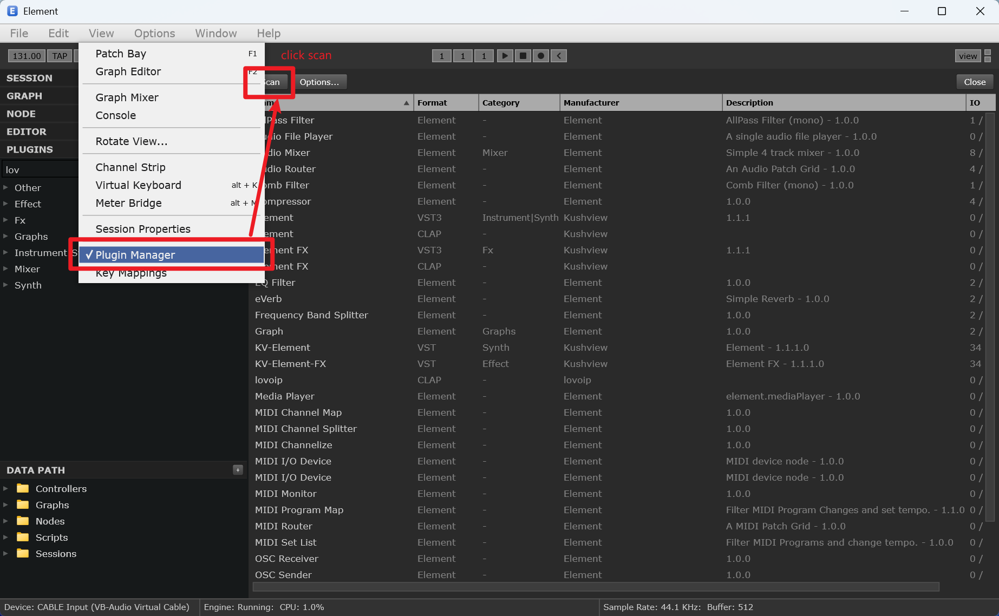
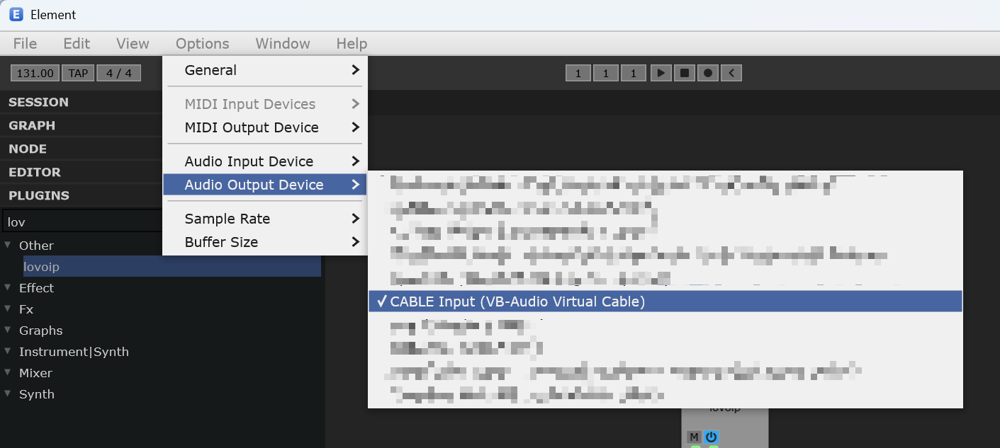
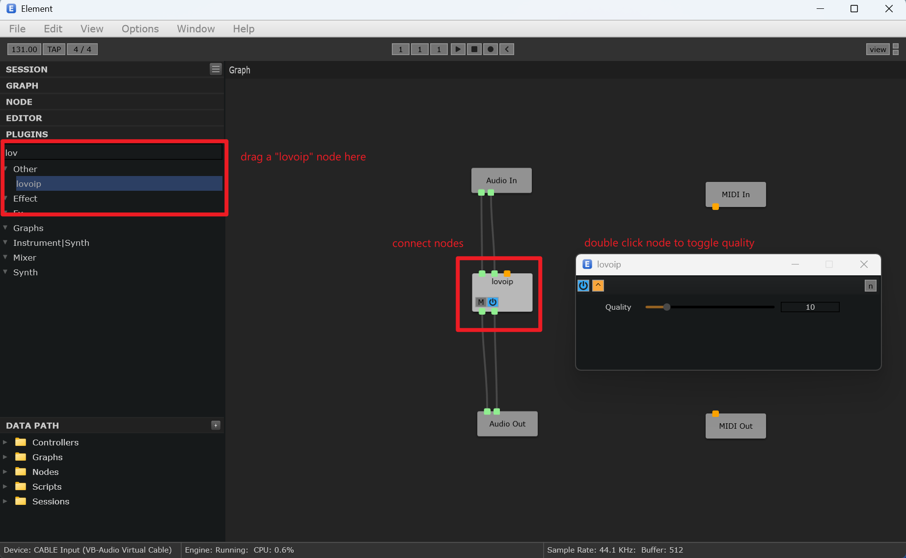

# lovoip

> NOTE: This project is NOT code reviewed by any human and solely generated by AI, since it is supposed for entertainment.

A CLAP audio-effect plugin that simulates the Source Engine `vaudio_celt`
voice codec sound using pure DSP - bandlimiting, codec-rate resampling, and
envelope-adaptive quantization. No external codec libraries are used.

## Usage

The plugin has a single **Quality** parameter (integer slider, `8` to `22`,
default **22**). The value couples bandlimit and bitrate the way Source's
`sv_voicequality` does: it is both the bandlimit in kHz and the bitrate in
kbps.

- **22** - cleanest; the classic full `vaudio_celt` setting (22 kHz / 22 kbps).
- **8** - grittiest; heavily band-limited and crushed (8 kHz / 8 kbps).

Lower values = more muffled and more quantized. The signal path is
sample-synchronous (zero added latency), so it can be automated and monitored
live without timing offset.

Works in Kushview Element and any other CLAP host.

### Installing in Element

1. [Download latest version](https://github.com/Paranoid-AF/lovoip/releases) and extract `lovoip.clap` file to `C:\Program Files\Common Files\CLAP`.

2. Open Kushview Element, open `View - Plugin Manager` from menu, and click "Scan".



3. Install [VB Audio Cable](https://vb-audio.com/Cable/) and choose `CABLE Input (VB-Audio Virtual Cable)` as output device. For input device, choose your actual microphone.



4. Drag `lovoip` from left plugin panel to graph nodes, connect it with audio input and output. Double click the plugin node to toggle quality level.



5. In your voice chat app, choose `CABLE Output (VB-Audio Virtual Cable)` as input device.

## Layout

```
include/lovoip/   public headers (param ids, version)
src/              plugin.cpp (CLAP glue), dsp.hpp/.cpp (codec simulation),
                  clap_plugin.hpp (plugin class)
scripts/          build.ps1, install.ps1, render.ps1
tests/            harness.cpp (offline CLAP host/renderer), voice_clips/
external/         clap/ (header submodule), licenses/
```

## Build (Windows, MSVC)

```
git submodule update --init --recursive
scripts\build.ps1
```

Produces `build\lovoip.clap` and `build\lovoip-harness.exe`.

`build.ps1` locates Visual Studio via `vswhere` and invokes `vcvars64.bat`;
if `cl.exe` is already on your PATH it is used directly.

## Install

```
scripts\install.ps1
```

Copies `lovoip.clap` to `%LOCALAPPDATA%\Programs\Common\CLAP\`. In Element,
rescan plugins (or restart) and **lovoip** appears under audio effects with
the tags `Voice`, `Codec`, `Lo-Fi`.

## Offline verification

```
scripts\render.ps1
```

Decodes the CC0 clips in `tests\voice_clips\` with ffmpeg, renders each
through the plugin at quality `8`, `15` and `22`, and writes WAVs to
`build\out\` for listening.

Harness usage:

```
build\lovoip-harness.exe <in.wav> <out.wav> [quality]
```

`quality` is the integer Quality value (8-22, default 22). Pass `--selftest`
as the input to run the built-in silence/parameter round-trip check.

## Third-party components

| Component          | License | Source                                        |
|--------------------|---------|-----------------------------------------------|
| CLAP headers 1.2.10| MIT     | https://github.com/free-audio/clap            |
| Test voice clips   | CC0 1.0 | `tests/voice_clips/`                          |

License texts: `external/licenses/clap-LICENSE.md` (vendored copy),
`external/licenses/voice_clips.md`. lovoip itself is MIT; see `LICENSE`.

## Trademarks & affiliation

This is an independent, unofficial project. It is **not affiliated with,
endorsed by, or sponsored by** any of the companies or projects named below.
All trademarks are the property of their respective owners:

- **Source**, **Source Engine**, and **Valve** are trademarks of Valve
  Corporation.
- **CLAP** (CLever Audio Plugin) is a trademark of u-he and Bitwig.
- **CELT** is an audio codec from the Xiph.Org Foundation.
- **Kushview Element** is a product of Kushview, LLC.
- **Opus** is a product of the Xiph.Org Foundation / IETF.

References to `vaudio_celt` and Source Engine voice quality describe the sound
this plugin imitates for interoperability and nostalgic effect only; no code or
assets from those products are used.
